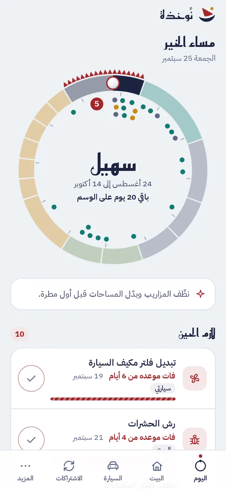
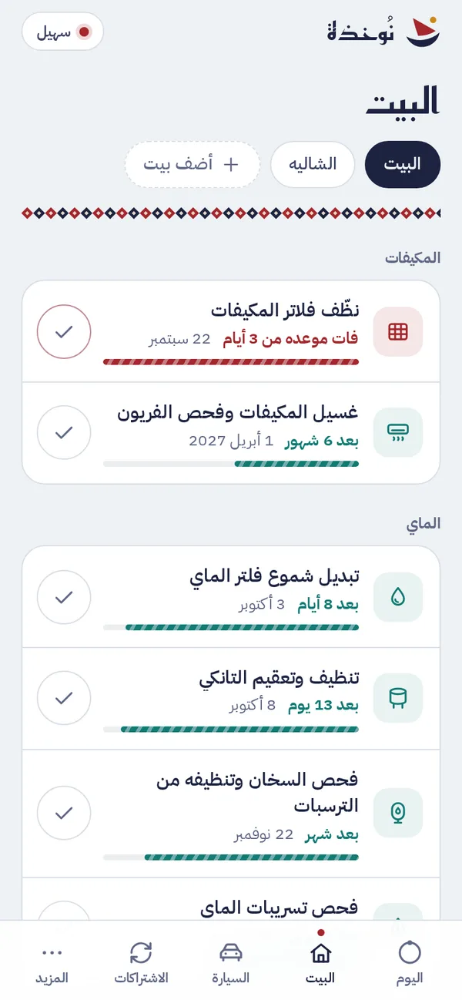
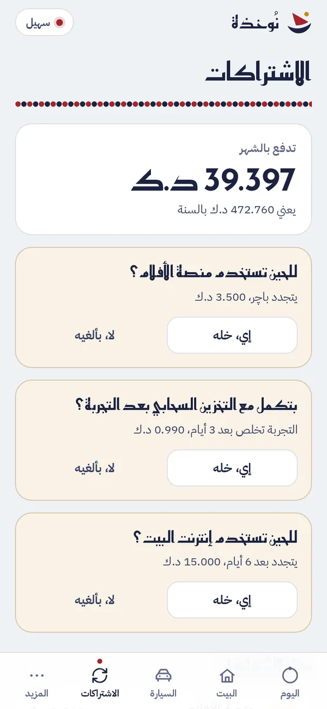

<p align="center">
  <picture>
    <source media="(prefers-color-scheme: dark)" srcset="docs/assets/brand/lockup-stacked-dark.svg">
    
  </picture>
</p>

<p align="center">
  <b>خلك نوخذة بيتك.</b><br>
  صيانة البيت والسيارة والاشتراكات على مواسم الخليج<br>
  Home, car and subscription reminders set to the Gulf's seasons
</p>

<p align="center">
  <a href="https://nokhatha.3li.info">nokhatha.3li.info</a> &nbsp;·&nbsp;
  <a href="https://nokhatha.3li.info/app/">افتح التطبيق · Open the app</a> &nbsp;·&nbsp;
  <a href="https://github.com/SiteQ8/Nokhatha/actions/workflows/test.yml"></a>
</p>

<p align="center">
  
  
  
</p>

<div dir="rtl">

## عن نُوخذة

النوخذة ربان سفينة الغوص والمسؤول عن كل شي فيها من الطاقم إلى المؤونة إلى الطريق، ونُوخذة تطبيق يخليك نوخذة بيتك فيذكرك بصيانة البيت والسيارة ويراقب اشتراكاتك الصامتة، وكل مواعيده مبنية على سنة الخليج من سهيل إلى الكليبين بدل تقويم عام ما يعرف حرنا ولا بوارحنا، وتقدر تستخدمه في الكويت والسعودية والإمارات وقطر والبحرين وعُمان بعملتك ورمز دولتك.

فتنظيف فلاتر المكيفات يصير كل شهر ويقرب لكل أسبوعين وقت البوارح، وغسيل المكيفات يجي قبل الكنة بأربع أسابيع، وفحص السطح والمزاريب قبل الوسم، والسخان قبل المربعانية، والتواير والبطارية ومكيف السيارة قبل القيظ.

## شنو يتابع لك

**البيت**، أي فلاتر المكيفات وغسيلها ومجاري المكيف المركزي والتانكي وفلتر الماي وشموعه والسخان والتسريبات والسطح والمزاريب وعوازل الدرايش وكاشف الدخان والطفاية وخرطوم الغاز والشفاط ورش الحشرات والكهرباء، ولكل بيت أو شقة أو شاليه أو مزرعة أو جاخور قائمته.

**السيارة**، أي الزيت والفلاتر على الكيلو أو الوقت أيهما أقرب، والعداد يتقدّر من قراءاتك، والتواير وضغطها وتبديلها والبطارية ومكيف السيارة وماي الرديانتر وزيت الفرامل والمساحات، وتجديد الدفتر والتأمين والفحص قبل ما تخلص.

**الاشتراكات**، أي كم تدفع بالشهر وبالسنة لكل عملة، وقبل كل تجديد بأسبوع يسألك التطبيق "للحين تستخدمه؟" فتلغي اللي ما تحتاجه قبل ما ينسحب المبلغ، والفترة التجريبية يذكرك فيها قبل لا تخلص.

**أشيائي**، أي شي ثاني تبي تتابعه مثل الطراد أو الدراجة النارية أو المولد أو المسبح أو الحديقة أو المخيم أو الحيوان الأليف مع مهامه المقترحة، أو شي تسميه بنفسك وتحط له مهامك ومددها، وفي شاشة "شنو عندك؟" تقدر تضيف أي شي ثاني في البيت مثل صيانة المصعد وتحدد كل متى.

**وغيرها**، أي الضمانات مع صورة الفاتورة وتذكير قبل نهايتها بشهر، ودفتر الفنيين بالاتصال والواتساب جنب المهام اللي تخصهم، وقائمة قبل سفرة الصيف، ومصاريف السنة، وتصدير المواعيد لتقويم جهازك مع تنبيه الساعة 9 الصبح، ونسخة احتياطية مشفّرة.

## مواسم الخليج في التطبيق

| الموسم | يبدأ | المجموعة |
| --- | --- | --- |
| سهيل | 24 أغسطس | الصفري |
| الوسم | 15 أكتوبر | الصفري |
| المربعانية | 6 ديسمبر | الشتاء |
| الشبط | 15 يناير | الشتاء |
| العقارب | 10 فبراير | الشتاء |
| الحميم | 8 مارس | الربيع |
| الذرعان | 3 أبريل | الربيع |
| الكنّة | 29 أبريل | القيظ |
| الثريا | 7 يونيو | القيظ |
| التويبع | 20 يونيو | القيظ |
| الجوزاء الأولى | 3 يوليو | القيظ |
| الجوزاء الثانية | 16 يوليو | القيظ |
| المرزم | 29 يوليو | القيظ |
| الكليبين | 11 أغسطس | القيظ |

والتواريخ على التقويم المتداول في الكويت والخليج وممكن تختلف البداية يوم أو يومين من منطقة لمنطقة، والبوارح من 7 يونيو إلى 28 يوليو، والتطبيق يرسم السنة كلها في دائرة تبدأ من اليوم، أي اللؤلؤة فوق هي اليوم والوقت يمشي مع عقارب الساعة وكل موسم قطعة بحجم أيامه.

## خصوصيتك

نُوخذة ما يطلب منك تسجيل ولا إيميل ولا رقم تلفون، لأن التطبيق ما يرسل بياناتك لأي مكان فما يحتاج يعرف منو أنت، وكل اللي تسجله من مهام واشتراكات وصور فواتير ينحفظ داخل جهازك، والمواعيد تنحسب على جهازك نفسه فهو اللي يتابع صيانتك مو سيرفر عندنا.

ولما نقول "بلا تتبع" نقصد إن التطبيق ما فيه أدوات إحصاء ولا إعلانات تراقب شنو تسوي، فإحنا ما نعرف منو يستخدمه ولا شنو سجل فيه، والتطبيق مقفول بسياسة أمان تمنعه يتصل بأي موقع ثاني.

والملفات نفسها تنزل من GitHub Pages أول مرة مثل أي موقع فيشوف GitHub طلب التحميل بس ما يشوف بياناتك، وبعدها يشتغل التطبيق من جهازك حتى بدون إنترنت.

وعشان ما في نسخة من بياناتك عند أحد، إذا غيرت جهازك أو مسحت بيانات المتصفح تروح بياناتك إلا إذا حفظت نسخة احتياطية من الإعدادات، والنسخة ملف تحفظه أنت وتفتحه في الجهاز الجديد وهو مشفّر بكلمة سر تختارها فلو وصل لأحد ثاني ما يقدر يقراه.

وعلى آيفون ثبّت التطبيق على الشاشة الرئيسية من زر المشاركة، لأن سفاري يمسح بيانات المواقع اللي ما تنفتح فترة والتطبيق المثبّت ما ينطبق عليه هالمسح.

والتنبيهات تشوفها أول ما تفتح التطبيق، وتقدر تصدّر المواعيد لتقويم جهازك فيجيك تنبيهها الساعة 9 الصبح، لأن تطبيق الويب بدون سيرفر ما يقدر يرسل إشعار وهو مسكّر، وتطبيقات آيفون وأندرويد الجاية بتطلّع تنبيهات من الجهاز نفسه بدون أي سيرفر.

وللتقنيين، البيانات في localStorage وصور الفواتير في IndexedDB، والنسخة الاحتياطية مشفّرة بـ AES-256-GCM بمفتاح مشتق من كلمة السر عن طريق PBKDF2-SHA256 بـ 600,000 دورة، وسياسة أمان المحتوى ما تسمح إلا بنفس المصدر، والخطوط مستضافة مع التطبيق.

## التشغيل والتطوير

التطبيق ملفات ثابتة بدون أي مكتبات خارجية، فتقدر تشغله محلياً بأي خادم ملفات من داخل مجلد docs وتفتح `/app/` على المتصفح، وبعد أول فتحة يشتغل بدون إنترنت وتقدر تثبته على الشاشة الرئيسية.

```sh
cd docs && python3 -m http.server 8000
# http://localhost:8000/app/?sample
npm test
```

والاختبارات تشغّل ملف `tests/vectors.json` وهو مجموعة قيم محسوبة باليد من التقويم، وراح تشتغل عليها نسخ آيفون وأندرويد كذلك حتى يعطي المحرك نفس المواعيد بالضبط على كل الأجهزة، وبعدها فحوصات على آلاف التواريخ وفحص لقواعد المشروع.

## الهيكل

| المسار | المحتوى |
| --- | --- |
| `docs/engine/nokhatha.js` | المحرك، أي حساب المواسم والمواعيد والعداد والاشتراكات والمبالغ والصياغة وملف التقويم |
| `docs/data/` | المواسم وقوالب المهام ونصوص الواجهة بالعربي والإنجليزي |
| `docs/app/` | تطبيق الويب مع دائرة السنة والتخزين والنسخة المشفّرة وعامل الخدمة |
| `docs/index.html` | صفحة التعريف على nokhatha.3li.info |
| `tests/` | القيم المشتركة والفحوصات |

## الخطة

تطبيق الويب متاح الحين، وبعده تطبيق آيفون بتنبيهات الجهاز وودجت للشاشة الرئيسية، ثم تطبيق أندرويد بنفس المزايا ونفس ملف النسخة الاحتياطية.

</div>

## About

A nokhatha was the captain of a Gulf pearling ship, answerable for everything aboard. Nokhatha makes you the captain of your home: it reminds you to look after the house and the car, keeps an eye on your silent subscriptions, and builds every date on the Gulf's traditional year from Suhail to Al-Kulaibain instead of a generic calendar that knows nothing about the Gulf summer or the Bawarih winds. It works in Kuwait, Saudi Arabia, the UAE, Qatar, Bahrain and Oman, with your currency and your country's dialling code.

AC filters come every month and every two weeks during the Bawarih, AC servicing lands four weeks before Al-Kinna, the roof and drains get checked before Al-Wasm, the water heater before Al-Murabbaniya, and tires, battery and the car's AC before the summer.

## What it tracks

- **Home**: AC filters and servicing, central AC ducts, the water tank, filter and cartridges, the water heater, leaks, the roof and drains, window seals, smoke alarms, the extinguisher, the gas hose, the kitchen hood, pest control and the electrical panel, with a separate list for every house, apartment, chalet, farm or jakhoor.
- **Car**: oil and filters by kilometres or time, whichever comes first, an odometer estimated from your readings, tires, pressure and rotation, battery, car AC, coolant, brake fluid and wipers, and registration, insurance and inspection before they expire.
- **Subscriptions**: what you pay per month and per year in each currency, a "still using it?" question a week before every renewal so you can cancel before the money leaves, and a reminder before free trials end.
- **My things**: anything else you want to keep track of, such as a boat, a motorbike, a generator, a pool, a garden, a camp or a pet with suggested tasks, or something you name yourself with your own tasks and intervals. The setup screen also takes anything else at home, like lift maintenance, with how often it is due.
- **And more**: warranties with a receipt photo, your technicians with call and WhatsApp next to their tasks, a pre-travel checklist, yearly spend, calendar export with a 9 am alert, and encrypted backups.

## Privacy

Nokhatha never asks you to sign up, because nothing you enter is sent anywhere and so it has no need to know who you are. Tasks, subscriptions and receipt photos are stored on your device, and the dates are calculated on your device too, so your phone is what keeps track of your maintenance, not a server of ours.

"No tracking" means there are no analytics, trackers or ads watching what you do. We cannot see who uses the app or what they record, and a strict content security policy stops the app from contacting any other site.

The files themselves download from GitHub Pages on the first visit like any website, so GitHub sees that download but never your data. After that the app runs from your device, even offline.

Because no copy of your data exists anywhere else, clearing your browser data or changing devices loses it unless you saved a backup from Settings. The backup is a file you keep yourself, encrypted with a passphrase you choose.

On iPhone, add the app to your home screen from the Share button: Safari clears data for websites you have not opened for a while, and installed web apps are exempt.

Reminders appear when you open the app, and you can export your dates to your phone's calendar for a 9 am alert. Without a server the web app cannot notify you while it is closed; the upcoming iPhone and Android apps schedule notifications on the device itself, still with no server.

Technical details: data in localStorage and receipt photos in IndexedDB, backups encrypted with AES-256-GCM using a key derived from the passphrase with PBKDF2-SHA256 at 600,000 iterations, a same-origin content security policy, and self-hosted fonts.

## Run and test

The app is static files with no dependencies. Serve the `docs` folder with any static server and open `/app/`. After the first visit it works offline and can be installed to the home screen.

```sh
cd docs && python3 -m http.server 8000
# http://localhost:8000/app/?sample
npm test
```

`tests/vectors.json` holds values worked out by hand from the calendar. The iOS and Android engines will run the same file, so every platform produces exactly the same dates. The runner then sweeps thousands of dates for structural properties, and `tests/lint.js` enforces the project rules.

## Roadmap

The web app is available now. An iPhone app with device notifications and a home screen widget comes next, then Android with the same features and the same backup format.

## License

[MIT](LICENSE) © 2026 Ali AlEnezi. Fonts: Reem Kufi and IBM Plex Sans Arabic under the SIL Open Font License, included in `docs/assets/fonts`.
